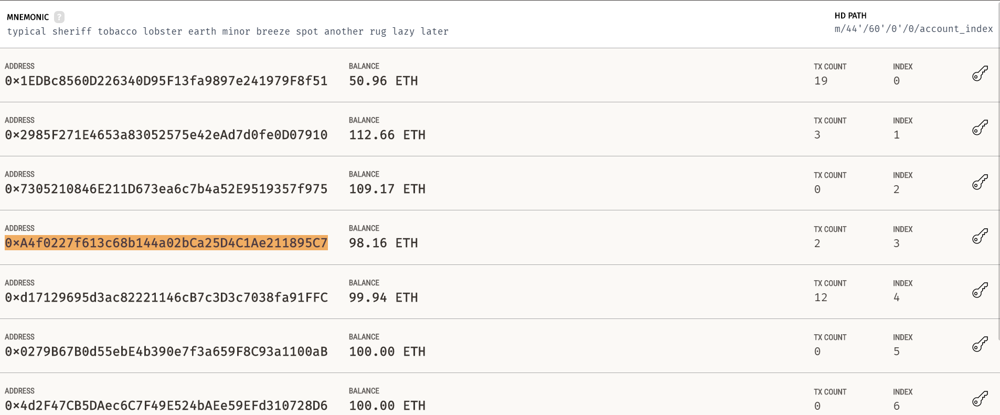
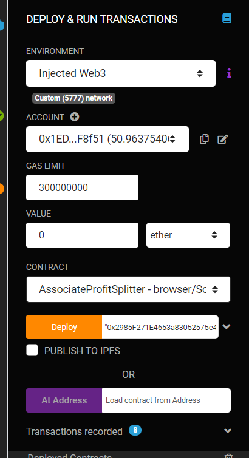
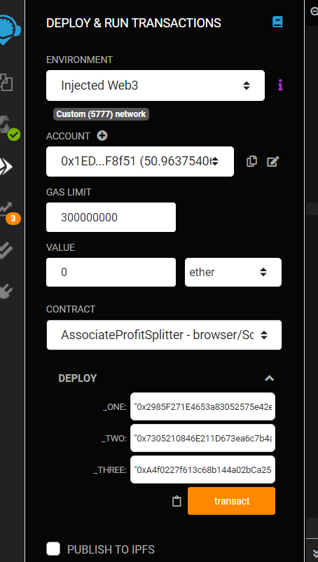
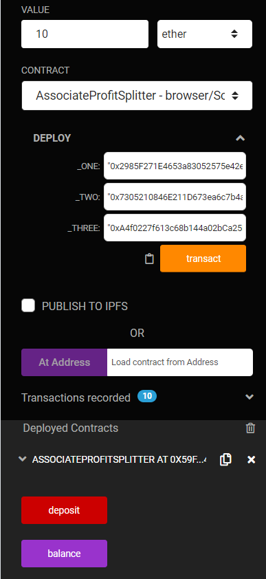
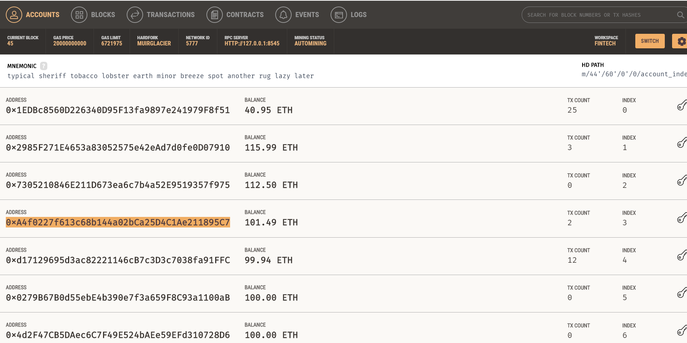
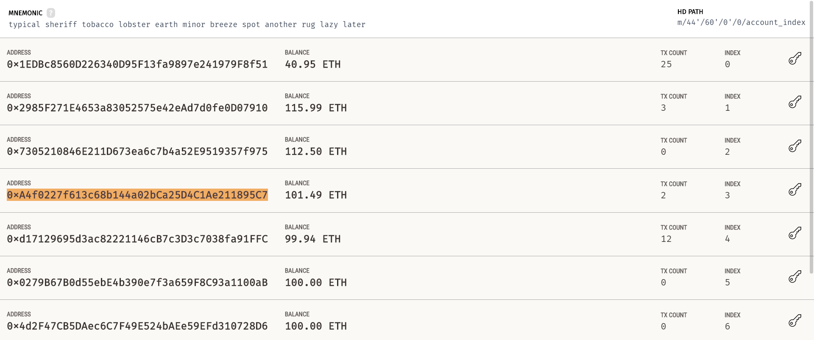
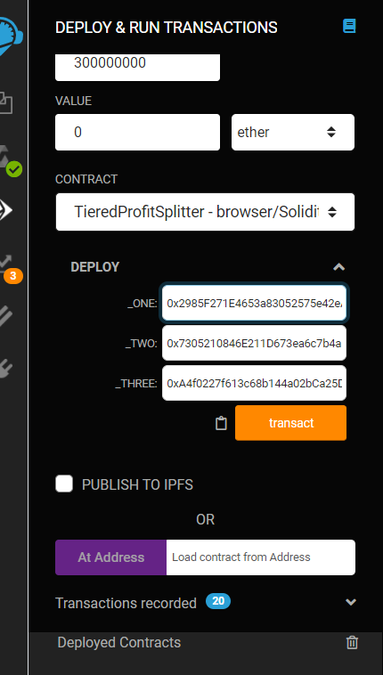
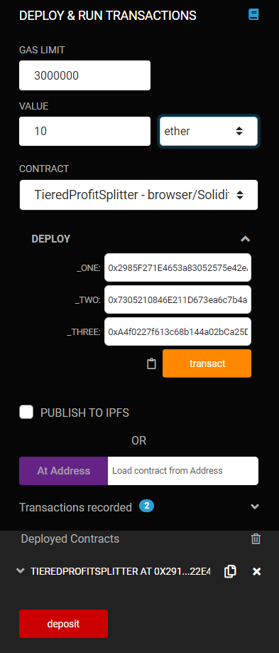
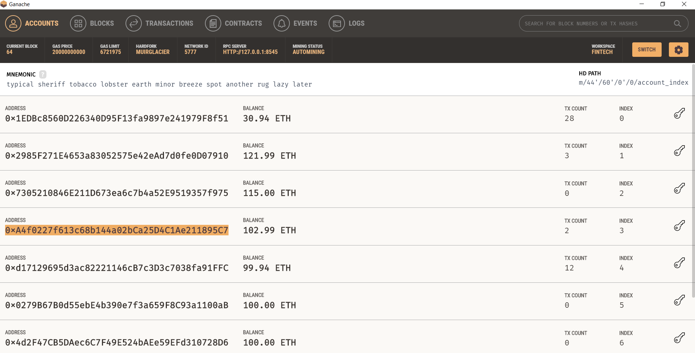

# OVERVIEW

This code for this assignment is to distribute hypothetical profits or bonus pools to employees.   There are two hypothetical scenarios and two coding files.   This code automates simple payment tasks and through the blockchain provides automatic accounting/auditing and transparency.   While employee compensation is typically confidential, some of the security features will have to be built later.  

## Scenario 1: Associate Profit Splitter

In this case, profits are distributed equally amongst three employees.

### Code:  [`AssociateProfitSplitter.sol`](Code/AssociateProfitSplitter.sol).  

The comments within the code are re-produced here. 

* Lines 3 to 7:   we name the contract and we create the three address payable variables, that correspond with the three employees.

* Lines 10 to 14:  this is the constructor function that will instruct Remix to ask the user to input the three addresses.   In our case, the addresses should come from one of our addresses in Ganache.  

* Lines 18 to 20:  this is the balance function, where the user can see the balance of the profit pool post the distribution.   It should be zero.   

* Lines 28 to 36:  this is the deposit function which is the crux of the program.   Within this function, the variable "amount" is 1/3 of the message value (i.e. the profit pool).  Each employee receives this "amount".  Technically, because we have defined amount as an unsigned integer; there will often times be a remainder when distributing the pool. This function is written to re-distribute the remainder back to the owner (HR).  However, as of now, the code utilizes floats and fully distributes the profits.

* Lines 38 to 40:  the fallback function calls upon the deposit function to ensure zero balance, if for whatever reason ether is sent to this contract.

* The squiggly bracket on Line 41 officially ends the contract for compiler.

* Once the code is complete, we compile it.   

### Ready for Deployment.

* Before we deploy it, let’s look at our Ganache accounts pre-deployment.   We are using the first four accounts.   The first account is where the money is coming from.   Accounts 2 to 4 will be receiving the money.  

 
* Now we’re ready for deployment.   

Next to the DEPLOY button, you'll see an address slot and then a little down arror.  Hit the down arrow. 

* In the value slot, enter “0” ether.   Then in the “_ONE”, “_TWO”, and “_THREE” slots, copy and paste addresses two to four from Ganache.   Hit Transact or Deploy button.

* Confirm the transaction in Metamask.

* Now let’s deposit.  Input 10 into the Value slot.  Make sure the dropdown to the right is set at ether.  We are distributing 10 ether to the three employees.  Hit Deposit Button.

* Let’s look at the Ganache accounts now.   

You’ll see that account 1 decreased by 10 ether (actually slightly more due to gas costs).   Accounts 2 to 4 each went up by 3.33 ether.

* If you hit the Balance function, you’ll see 0 wei.

* That’s it for Associate Profit Splitter.

## Scenario 2: Tiered Profit Splitter

In this case, profits are distributed in unequal percentages depending upon the rank of the employee.  The percentages are 60%, 25% and 15%.   

### Code:  [`TieredProfitSplitter.sol`](Code/TieredProfitSplitter.sol).
 

* Lines 3 to 6:   we name the contract and we create the three address payable variables, that correspond with the three employees.

* Lines 10 to 14:  this is the constructor function that will instruct Remix to ask the user to input the three addresses.   In our case, the addresses should come from one of our addresses in Ganache.  

* Lines 18 to 20:  this is the balance function, where the user can see the balance of the profit pool post the distribution.   It should be zero.   

* Lines 29 to 48:  this is the deposit function which is the crux of the program.   Within this function, the variable "points" is used to denote percent.  It will convert the message value (i.e. the profit pool) into various percentage values. Each employee will receive one of three percentage values of msg.value.  The variable "amount" will be used to distribute three different percentage values of the pool to the corresponding employee.  Technically, because we have defined amount as an unsigned integer, there should be a remainder after distributing the profit pool. The variable "total" is supposed to compute the remainder post the three distributions.  Total should then be sent back to employee #1, the CEO. However, as of now the code utilizes floats and fully distributes the profits.

* Lines 50 to 52:  the fallback function calls upon the deposit function to ensure zero balance, if for whatever reason ether is sent to this contract.

* The squiggly bracket on Line 53 officially ends the contract for compiler.

* Once the code is complete, we compile it.   

### Ready for Deployment.

* Before we deploy it, let’s look at our Ganache accounts pre-deployment.  We are using the first four accounts.   The first account is where the money is coming from.   Accounts 2 to 4 will be receiving the money.  

* Now we’re ready for deployment.   In the value slot, enter “0” ether.   Then in the “_ONE”, “_TWO”, and “_THREE” slots, copy and paste addresses two to four from Ganache.   Hit Transact or Deploy button.

* Confirm the transaction in Metamask.

* Now let’s deposit.  Input 10 into the Value slot.  Make sure the dropdown to the right is set at ether.  We are distributing 10 ether to the three employees. Hit Deposit Button.

* Let’s look at the Ganache accounts now.   You’ll see that account 1 decreased by 10 ether (actually slightly more due to gas costs).   Account 2 went up by 6 ether, Account 3 by 2.5 ether and Account 4 by 1.5 ether.

* If you hit the Balance function, you’ll see 0 wei.

* That’s it for Tiered Profit Splitter.

**Note:  The third plan, Deferred Equity Plan was optional and not completed.**
